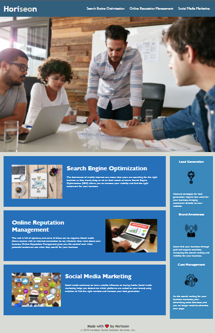

## Homework 1

# Marketing Website Mockup

## Refactoring

Our first homework for this bootcamp. This is to showcase what I've learnt in the first week of the bootcamp.

## The tasks include

- To make a codebase that follows accessibility standards.
- To make the site optimized for search engines.

## Problems

1. One link tag not funtioning correctly.
2. CSS Selectors and properties were not consolidated and organized to follow semantic structure.
3. No comments on the CSS file.

## Solutions

1. Added an ID tag to make the broken link work.
2. Fixed selectors an properties names to consolidate and organize semantic structure.
3. Added comments on the CSS file.

**Note**: All required files have been pushed to the repository.

## Final product

---

© Carl Santiago\
📧 4518gg@gmail.com
